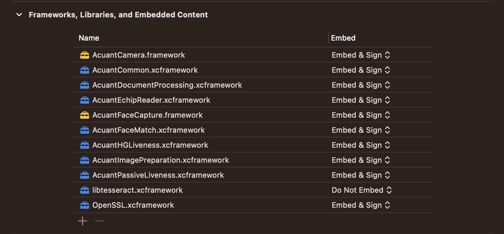
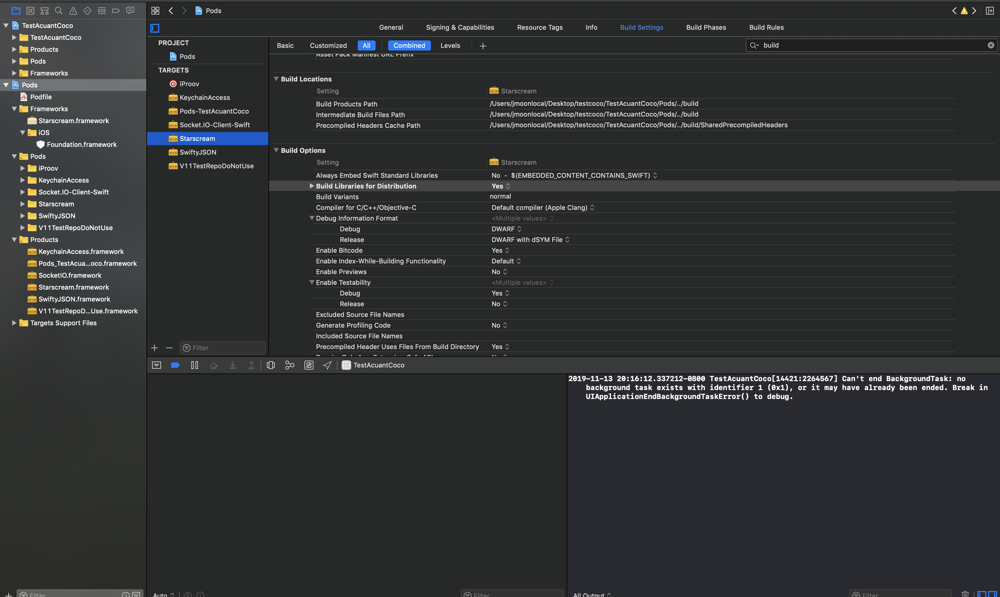

# Acuant iOS SDK v11.5.4

**October 2021**

See [https://github.com/Acuant/iOSSDKV11/releases](https://github.com/Acuant/iOSSDKV11/releases) for release notes.

----------

## License
This software is subject to Acuant's end user license agreement (EULA), which can be found [here](EULA.pdf).

----------

## Introduction

This document provides detailed information about the Acuant iOS SDK. The Acuant-recommended workflow is described below.

**Note:** The acceptable quality image is well-cropped, sharp and with no glare present, has a resolution of at least 300 dpi (for data capture) or 600 dpi (for authentication). The aspect ratio should be acceptable and matches an ID document.

----------

## Updating to 11.5.1+

Please see the provided [migration details document](iOSmigrationdetails.pdf) for information about updating to 11.5.1+

----------

## Prerequisites

- iOS version 11.0 or later
- Xcode 12.5.1+

## Modules

The SDK includes the following modules:

**Acuant Face Capture Library (AcuantFaceCapture):**

- Uses native iOS Camera to capture face.

**Acuant Passive Liveness Library (AcuantPassiveLiveness):**

- Uses proprietary algorithm to detect a live person

**Acuant Common Library (AcuantCommon):**

- Contains all shared internal models and supporting classes

**Acuant Camera Library (AcuantCamera):**

- Implemented using iOS native camera library
- Uses **AcuantImagePreparation** for cropping
- Uses **https://github.com/gali8/Tesseract-OCR-iOS** for OCR on device

**Acuant Image Preparation Library (AcuantImagePreparation):**

- Contains all image processing such as cropping, calculation of sharpness and glare

**Acuant Document Processing Library (AcuantDocumentProcessing):**

- Contains all the methods to upload the document images, process and get results

**Acuant Face Match Library (AcuantFaceMatch):**

- Contains a method to match two facial images

**Acuant EChip Library (AcuantEchipReader):**

- Contains methods for e-Passport chip reading and authentication using Ozone

**Acuant HG Liveness Library (AcuantHGLiveness):**

- Uses iOS native camera library to capture facial liveness using a proprietary algorithm

**Acuant IP Liveness Library (AcuantIPLiveness):**

- Uses proprietary algorithm to detect a live person

**Note:** IP Liveness is now referred to in the UI as Enhanced Liveness. 

----------
### Manual Setup

1. Add the following dependent embedded frameworks:

 -	**AcuantFaceCapture**
 -	**AcuantPassiveLiveness**
 -	**AcuantCommon**
 -	**AcuantImagePreparation**
 -	**AcuantDocumentProcessing**
 -	**AcuantHGLiveness**
 -	**AcuantFaceMatch**
 -	**AcuantEchipReader**
 -	**AcuantCamera**
 		- TesseractOCR.framework
 -	**AcuantIPLiveness**
	 	- iProov.xcframework
 		- SocketIO.xcframework
 		- Starscream.xcframework

	

	**Note:** AcuantCamera and AcuantFaceCapture are open projects. You will have to add the source code to your solution for frameworks.

1. Get Carthage [https://github.com/Carthage/Carthage](https://github.com/Carthage/Carthage)

   **Note:** The SDK does not support downloading from Carthage. The usage of Carthage here is to simplify copying frameworks and slicing unwanted architectures.

1. Open your project in Xcode and navigate to Build Phases tab in application project settings. Add a "New Run Script".

1.  Add the following to the script.

		/usr/local/bin/carthage copy-frameworks

1. Create new inputFileList.xcfilelist and outputFileList.xcfilelist. Add necessary frameworks to both files. Example in repository.

1. Add the .xcfilelist to your run script.

	For additional information, please visit [https://github.com/Carthage/Carthage](https://github.com/Carthage/Carthage).

----------

### Using CocoaPods

**Important Note:** When using import statements for open projects (specifically AcuantCamera and AcuantFaceCapture) with CocoaPods, please use `import AcuantiOSSDKV11` in Xcode.

1. Add the following in the podfile to get **all** the modules:

		platform :ios, '11'
		pod 'AcuantiOSSDKV11', '~> 11.5.4' #for all packages
		
 Alternatively, use the following to add **independent** modules in the podfile:
		
 - AcuantCamera

			pod 'AcuantiOSSDKV11/AcuantCamera'
			dependency AcuantImagePreparation
			dependency AcuantCommon
					
			pod 'AcuantiOSSDKV11/AcuantCamera/Document' # if you want Document camera
			
			pod 'AcuantiOSSDKV11/AcuantCamera/Mrz' # if you want MRZ camera
			dependency TesseractOCRiOS
			
			pod 'AcuantiOSSDK11/AcuantCamera/Barcode' # if you want Barcode camera

 - AcuantFaceCapture

			pod 'AcuantiOSSDKV11/AcuantFaceCapture'

 - AcuantImagePreparation

			pod 'AcuantiOSSDKV11/AcuantImagePreparation'
			dependency AcuantCommon
			
 - AcuantDocumentProcessing

			pod 'AcuantiOSSDKV11/AcuantDocumentProcessing'
			dependency AcuantCommon

 - AcuantHGLiveness

			pod 'AcuantiOSSDKV11/AcuantHGLiveness'
			dependency AcuantCommon
			
 - AcuantIPLiveness

			pod 'AcuantiOSSDKV11/AcuantIPLiveness'
			dependency AcuantCommon
			dependency iProov

 - AcuantPassiveLiveness

			pod 'AcuantiOSSDKV11/AcuantPassiveLiveness'
			dependency AcuantCommon
			
 - AcuantFaceMatch

			pod 'AcuantiOSSDKV11/AcuantFaceMatch'
			dependency AcuantCommon

 - AcuantEchipReader

			pod 'AcuantiOSSDKV11/AcuantEchipReader'
			dependency AcuantCommon
		
1. Enable "BUILD\_LIBRARY\_FOR\_DISTRIBUTION" for all Acuant pod frameworks in Build Settings.

	- Using Cocoapods. Add to your Podfile.
		
			post_install do |installer|
				installer.pods_project.targets.each do |target|
					if ['AcuantiOSSDKV11', 'Socket.IO-Client-Swift', 'Starscream'].include? target.name
						target.build_configurations.each do |config|
							config.build_settings['BUILD_LIBRARY_FOR_DISTRIBUTION'] = 'YES'
						end
					end
				end
			end
	
	- Manually
	
		
		

----------

### Required Setup
Create a **plist** file named **AcuantConfig** that includes the following details:

    	<?xml version="1.0" encoding="UTF-8"?>
		<!DOCTYPE plist PUBLIC "-//Apple//DTD PLIST 1.0//EN" "http://www.apple.com/DTDs/PropertyList-1.0.dtd">
		<plist version="1.0">
			<dict>
				<key>acuant_username</key>
				<string>xxxxxx@acuantcorp.com</string>
				<key>acuant_password</key>
				<string>xxxxxxxxxx</string>
				<key>acuant_subscription</key>
				<string>xxxxxxxxxxxxxxxxxxxxxxxxxxxxxxxxx</string>
				<key>frm_endpoint</key>
				<string>https://frm.acuant.net</string>
				<key>passive_liveness_endpoint</key>
				<string>https://us.passlive.acuant.net</string>
				<key>med_endpoint</key>
				<string>https://medicscan.acuant.net</string>
				<key>assureid_endpoint</key>
				<string>https://services.assureid.net</string>
				<key>acas_endpoint</key>
				<string>https://acas.acuant.net</string>
				<key>ozone_endpoint</key>
				<string>https://ozone.acuant.net</string>
			</dict>
		</plist>
	
	The following are the default values for testing purposes:
	
		PREVIEW
				<key>frm_endpoint</key>
				<string>https://preview.face.acuant.net</string>
				<key>passive_liveness_endpoint</key>
				<string>https://preview.passlive.acuant.net</string>
				<key>med_endpoint</key>
				<string>https://preview.medicscan.acuant.net</string>
				<key>assureid_endpoint</key>
				<string>https://preview.assureid.acuant.net</string>
				<key>acas_endpoint</key>
				<string>https://preview.acas.acuant.net</string>
				<key>ozone_endpoint</key>
				<string>https://preview.ozone.acuant.net</string>
		
	The following are the default values based on region:

		USA
			<key>frm_endpoint</key>
			<string>https://frm.acuant.net</string>
			<key>passive_liveness_endpoint</key>
			<string>https://us.passlive.acuant.net</string>
			<key>med_endpoint</key>
			<string>https://medicscan.acuant.net</string>
			<key>assureid_endpoint</key>
			<string>https://services.assureid.net</string>
			<key>acas_endpoint</key>
			<string>https://acas.acuant.net</string>
			<key>ozone_endpoint</key>
			<string>https://ozone.acuant.net</string>

		EU
			<key>frm_endpoint</key>
			<string>https://eu.frm.acuant.net</string>
			<key>passive_liveness_endpoint</key>
			<string>https://eu.passlive.acuant.net</string>
			<key>assureid_endpoint</key>
			<string>https://eu.assureid.acuant.net</string>
			<key>acas_endpoint</key>
			<string>https://eu.acas.acuant.net</string>
			<key>ozone_endpoint</key>
			<string>https://eu.ozone.acuant.net</string>

		AUS
			<key>frm_endpoint</key>
			<string>https://aus.frm.acuant.net</string>
			<key>passive_liveness_endpoint</key>
			<string>https://aus.passlive.acuant.net</string>
			<key>assureid_endpoint</key>
			<string>https://aus.assureid.acuant.net</string>
			<key>acas_endpoint</key>
			<string>https://aus.acas.acuant.net</string>
			<key>ozone_endpoint</key>
			<string>https://aus.ozone.acuant.net</string>

### Initialize

**Initialization**
Before you use the SDK, you must initialize it, either by using the credentials saved on the device or by using bearer tokens (provided by an external server).

1. Select packages for initialization.

		let packages = [AcuantEchipPackage(), ImagePreparationPackage()]

1. Initialize the SDK. 
		
		let initalizer: IAcuantInitializer = AcuantInitializer()
        
		let task = initalizer.initialize(packages: packages){ [weak self]
			error in
				if let err = error{
					//error
				}
				else{
					//success
				}	
        }
                
	**Note:** If you are *not* using a configuration file for initialization, then use the following statement (providing appropriate credentials for *username*, *password*, and *subscription ID*):
	
		Credential.setUsername(username: "xxx")
		Credential.setPassword(password: "xxxx")
		Credential.setSubscription(subscription: "xxxxxx")

		let endpoints = Endpoints()
		endpoints.frmEndpoint = "https://frm.acuant.net"
		endpoints.healthInsuranceEndpoint = "https://medicscan.acuant.net"
		endpoints.idEndpoint = "https://services.assureid.net"
		endpoints.acasEndpoint = "https://acas.acuant.net"
		endpoints.ozoneEndpoint = "https://ozone.acuant.net"

		Credential.setEndpoints(endpoints: endpoints)		
### Bearer Tokens

1. Use Acuant Services to retrieve a token. Acuant recommends using a proxy service to retrieve the token to ensure integrity of credentials.

2. Set the token:

		if let success = Credential.setToken(token: ""){
			//token was valid
		}
		else{
			//invalid or expired token
		}

3. Tokens will eventually expire, depending on the provided settings. Use the method below to ensure token is still valid before reusing the token.

		if let token : AcuantJwtToken = Credential.getToken(){
			let valid: Bool = token.isValid()
		}
		
4. **Note:** If token is set, all service calls will attempt to authorize using the token. If the token is not set, the legacy credentials will be used.

5. **Important Note:** You will still need to provide the SubscriptionId in the Credential object in order to use Acuant Services with bearer tokens.
	
		
### Initialization without a Subscription ID

**AcuantImagePreparation** may be initialized by providing only a username and a password. However, without providing a Subscription ID, the application can only capture an image and get the image.
 
Initialize without a Subscription ID:

-	Only the **AcuantCamera**, **AcuantImagePreparation**, and **AcuantHGLiveness** modules may be used.
-	The SDK can be used to capture the identity documents.
-	The captured images can be exported from the SDK. See the **DocumentCaptureDelegate** protocol in the **AcuantCamera** project.
		
----------

### Capture an Image using AcuantCamera

AcuantCamera is best used in portrait mode. Lock the orientation of the app before using Camera. 

1. Set up callbacks:
		
		// Returns the image and barcodeString captured from device
		public protocol CameraCaptureDelegate {
	    	func setCapturedImage(image:Image, barcodeString:String?)
		}
		
1. Open the camera. Options can be defined through an options object. See **CameraOptions** for all configurable fields.
		
		let options = CameraOptions(autoCapture: true, hideNavigationBar: true)
		let documentCameraController = DocumentCameraController.getCameraController(delegate:self!, cameraOptions: options)
        
		navigationController.pushViewController(documentCameraController, animated: false)
        
 **Note:** When the camera is launched, the image processing speed is automatically checked.

 * Live document detection and auto capture features are enabled if the device supports a speed of at least 130ms.
 * For devices that don't meet the processing threshold, tap to capture will be enabled. Live document detection and auto capture features are disabled and switched to tap to capture. The user will have to manually capture the document.

1. Get the captured image:

		public protocol CameraCaptureDelegate {
	    	func setCapturedImage(image:Image, barcodeString:String?)
		}
		
1. User canceled:
		
		func setCapturedImage(image:Image, barcodeString:String?){
			if let success = image.image{
			}
			else{
				//user has canceled
			}
		}
		
		
		
**Using Custom UI with DocumentCaptureSession (see DocumentCameraController.swift for reference):**

1. Get the DocumentCaptureSession.
		
		public protocol DocumentCaptureDelegate {
		    func readyToCapture() // gets called when triggering capture
		    func documentCaptured(image:UIImage, barcodeString:String?) // gets called with captured result
		}
		
		let captureSession = DocumentCaptureSession.getDocumentCaptureSession(
			delegate: DocumentCaptureDelegate, // session callback
			frameDelegate: FrameAnalysisDelegate, // frame analysis callback
			autoCaptureDelegate: AutoCaptureDelegate, // enable frame analysis/auto capture
			captureDevice: AVCaptureDevice?) // AV Capture Device 
			
1. Start the session, and then add the session to AVCaptureVideoPreviewLayer.

		captureSession.start() // will start the capture session.
		let videoPreviewLayer = AVCaptureVideoPreviewLayer(session: captureSession)
		
		//write your own custom UI code

		
1. Receive Frame Results.
		
		public enum FrameResult : Int{
		    case NO_DOCUMENT, // No document
		    	SMALL_DOCUMENT, // Document is small
		    	BAD_ASPECT_RATIO, // Document type does not match aspect ratio
		    	GOOD_DOCUMENT, // Document is good to trigger capture
		    	DOCUMENT_NOT_IN_FRAME // Document is not in frame
		}
		
		public protocol FrameAnalysisDelegate{
		    func onFrameAvailable(frameResult: FrameResult, points: Array<CGPoint>?)
		}
		
1. Trigger capture.

		captureSession.enableCapture()
		
1. DocumentCaptureDelegate will be executed with result
	
		func documentCaptured(image:UIImage, barcodeString:String?)

**Note:** **AcuantCamera** is dependent on **AcuantImagePreparation** and  **AcuantCommon**.

----------
### Capture a document barcode using AcuantCamera

**Note:** During regular capture of a document, the camera attempts to read the barcode. Launch this camera mode only if the barcode is expected according to document classification and failed to read during normal capture of the relevant side.

1. Set up delegate:

            @objc public protocol BarcodeCameraDelegate: AnyObject {
                func captured(barcode: String?)
            }

1. Open the camera:

            let options = CameraOptions(timeInMsPerDigit: 1000,
                                        digitsToShow: 20,
                                        colorHold: UIColor.white.cgColor,
                                        colorCapturing: UIColor.green.cgColor)
            let barcodeCamera = BarcodeCameraViewController(options: options, delegate: self)
            navigationController?.pushViewController(barcodeCamera, animated: false)

 **Note:** Be aware that **timeInMsPerDigit** will be used as the time to wait after the barcode is detected and **digitsToShow** (in seconds) will be used as a timeout. When the timeout is reached the camera will be closed.

----------
### Read MRZ using AcuantCamera

1. Add Tesseract dependency. See https://github.com/gali8/Tesseract-OCR-iOS

1. Add the OCRB Training data to you project. We recommend using the training data resource in Assets directory of the Sample App. Please refer to https://www.raywenderlich.com/2010498-tesseract-ocr-tutorial-for-ios#toc-anchor-005.

1. Set View Controller UI customizations.

		public enum MrzCameraState : Int {
			case None = 0, Align = 1, MoveCloser = 2, TooClose = 3, Good = 4, Captured = 5
		}
		
		let vc = AcuantMrzCameraController()
		vc.options = CameraOptions()
		
		vc.customDisplayMessage : ((MrzCameraState) -> String) = {
			state in
				switch(state){
					case .None, .Align:
						return ""
					case .MoveCloser:
						return "Move Closer"
					case .TooClose:
						return "Too Close!"
					case .Good:
						return "Reading MRZ"
					case .Captured:
						return "Captured"
				}
		}

		
1. Set callback.

		vc.callback : ((AcuantMrzResult?) -> Void)? = { [weak self]
			result in
			
				if let success = result{
					DispatchQueue.main.async {
						//pop or dismiss the View Controller
						self?.navigationController?.popViewController(animated: true)
					}
				}
				else{
					//User Canceled
				}
		}	

1. Present or Push the View Controller. Push is shown in example.

		self.navigationController?.pushViewController(controller, animated: false)

1. Result.

		public class AcuantMrzResult{
			public var surName:String = ""
			public var givenName:String = ""
			public var country:String = ""
			public var passportNumber: String = ""
			public var nationality:String = ""
			public var dob: String = ""
			public var gender: String = ""
			public var passportExpiration: String = ""
			public var personalDocNumber: String = ""
			public var checkSumResult1: Bool = false
			public var checkSumResult2: Bool = false
			public var checkSumResult3: Bool = false
			public var checkSumResult4: Bool = false
			public var checkSumResult5: Bool = false
		}

----------
### AcuantEchipReader

1. Configure the application to detect NFC Tags. Add "Near Field Communication" Capability to the target app under Signing and Capability in Xcode. Then, add "NFCReaderUsageDescription" key to the Info.plist of the app. For more info, please look at "Configure the App to Detect NFC Tags" on https://developer.apple.com/documentation/corenfc/building_an_nfc_tag-reader_app.

1. Add "ISO7816 application identifiers for NFC Tag Reader Session" key with "A0000002471001" as item value in application info.plist.

1. AcuantEchipPackage must be initialized in the previous step.

1. This feature is only available in iOS version 13 and above. You will need to use the @available attribute to use methods inside module.

1. Create an instance of Acuant Reader. Make sure this object does not get disposed while reading.

		private let reader: IEchipReader = EchipReader()
		
1. Create a session request.

		let request = AcuantEchipSessionRequest(passportNumber: "", dateOfBirth: "", expiryDate: "")
		
1. Set custom messages based on state of reader.

		public enum AcuantEchipDisplayMessage {
		    case requestPresentPassport
		    case authenticatingWithPassport(Int)
		    case readingDataGroupProgress(String, Int)
		    case error
		    case authenticatingExtractedData
		    case successfulRead
		}

		let customDisplayMessage : ((AcuantEchipDisplayMessage) -> String?) =  {
			message in
    
				switch message {
					case .requestPresentPassport:
						return "Hold your iPhone near an NFC enabled passport."
					case .authenticatingWithPassport(let progress):
	                let progressString = handleProgress(percentualProgress: progress)
	                return "Authenticating with passport.....\n\n\(progressString)"
					case .readingDataGroupProgress(let dataGroup, let progress):
						let progressString = handleProgress(percentualProgress: progress)
						return "Reading \(dataGroup).....\n\n\(progressString)"
					case .error:
						return "Sorry, there was a problem reading the passport. Please try again"
					case .successfulRead:
						return "Passport read successfully"
					case .authenticatingExtractedData:
						return "Authenicating with Ozone"
            }
		}
    
            
1. Start the reader. 

		self.reader.readNfcTag(request: request, customDisplayMessage: customDisplayMessage){ [weak self]
			(model, error) in
				if let result = model{
                    //success
				}
				else{
					if let err = error{
						//error
					}
					else{
						//user canceled
					}  
				}
		}
		
1. Result.

		public class AcuantPassportModel {
			public var documentType : String
			public var documentSubType : String
			public var personalNumber : String
			public var documentNumber : String
			public var issuingAuthority : String
			public var documentExpiryDate : String
			public var firstName : String
			public var lastName : String
			public var dateOfBirth : String
			public var gender : String
			public var nationality : String
			public var image : UIImage?
			public var passportSigned = OzoneResultStatus.UNKNOWN
			public var passportCountrySigned = OzoneResultStatus.UNKNOWN
			public var passportDataValid = false
			public var age: Int?
			public var isExpired: Bool?
			    
		    public func getRawDataGroup(dgId: AcuantDataGroupId) -> [UInt8]?{
		        return self.dataGroups[dgId]
		    }
		}
		
		public enum OzoneResultStatus : Int{
		    case SUCCESS
		    case FAILED
		    case UNKNOWN
		}

		public enum AcuantDataGroupId : Int {
		    case COM
		    case DG1
		    case DG2
		    case DG3
		    case DG4
		    case DG5
		    case DG6
		    case DG7
		    case DG8
		    case DG9
		    case DG10
		    case DG11
		    case DG12
		    case DG13
		    case DG14
		    case DG15
		    case DG16
		    case SOD
		    case Unknown
		}
		
1. Map country to passport.

		public let AcuantCountryDataPageMap: [String: String]
		//{ "CountryCode": "Location" }
	

----------
### AcuantImagePreparation

This module contains all image preparation functionality.

#### Cropping, Sharpness, and Glare

After an image is captured, it is cropped and checked for sharpness and glare. This is done using the **evaluateImage** of **AcuantImagePreparation**.

	public class func evaluateImage(data: CroppingData, callback: (AcuantImage, AcuantError) -> ())
	
To create the CroppingData used above, use the following method passing in the Image that you received from the camera:

	CroppingData.newInstance(image: Image)

The callback returns the **AcuantImage** and **AcuantError**. The **AcuantImage** can be used to verify the crop, sharpness, and glare of the image, and then upload the document in the next step (see [AcuantDocumentProcessing](#acuantdocumentprocessing)).

	public class AcuantImage {
		public let image: UIImage
		public let data: NSData
		public let sharpness: Int
		public let glare: Int
		public let dpi: Int
		public let isPassport: Bool
	}	
	
If the sharpness value is greater than 50, then the image is considered sharp (not blurry). If the glare value is 100, then the image does not contain glare. If the glare value is 0, then image contains glare.
	
Preferably, the image must be sharp and not contain glare to get best results in authentication and data extraction. When the image has glare, low sharpness, or both, retry the capture.
	
Acuant recommends against modifying and/or compressing the resulting AcuantImage.image before uploading. Modifying and/or compressing the AcuantImage.image may negatively affect authentication and data extraction results.

**Note:** If you are using an independent orchestration layer, then make sure you supply AcuantImage.data not just AcuantImage.image.	

----------
### AcuantDocumentProcessing

After you capture a document image and completed crop, it can be processed using the following steps.

**Note:** If an upload fails with an error, retry the image upload using a better image.

1. Create an instance:

		public class func createInstance(options:IdOptions,delegate:CreateInstanceDelegate)

		public protocol CreateInstanceDelegate{
    		func instanceCreated(instanceId: String?,error:AcuantError?);
		}
		
1. Prepare the image. You must pass in **AcuantImage.data** and **idData.barcodeString** (when applicable) in **EvaluatedImageData**.

		public class EvaluatedImageData {
			public let imageBytes: NSData
			public let barcodeString: String?
			public init(imageBytes: NSData, barcodeString: String?)
		}
	
1. Upload the image:

		public class func uploadImage(instancdId:String,data:EvaluatedImageData,options:IdOptions,delegate:UploadImageDelegate)

		public protocol UploadImageDelegate{
    		func imageUploaded(error: AcuantError?,classification:Classification?);
		}

1. Get the data:

		public class func getData(instanceId:String,isHealthCard:Bool,delegate:GetDataDelegate?)

		public protocol UploadImageDelegate{
    		func imageUploaded(error: AcuantError?,classification:Classification?);
		}

1. Delete the instance:

		public class func deleteInstance(instanceId : String,type:DeleteType, delegate:DeleteDelegate)

		public protocol DeleteDelegate {
    		func instanceDeleted(success : Bool)
		}

----------
### Acuant Face Capture

1. (Optional) Set default Image. Locate "acuant\_default\_face_image.png" in the Assets directory of sample app project. Add this to your app if needed.
	
1. Set localized strings in app's localizables:
		
		"acuant_face_camera_initial" = "Align face to start capture";
		"acuant_face_camera_face_too_close" = "Too Close! Move Away";
		"acuant_face_camera_face_too_far" = "Move Closer";
		"acuant_face_camera_face_has_angle" =  "Face has Angle. Do not tilt";
		"acuant_face_camera_face_not_in_frame" =  "Move in Frame";
		"acuant_face_camera_face_moved" = "Hold Steady";
		"acuant_face_camera_capturing_2" = "Capturing\n2...";
		"acuant_face_camera_capturing_1" = "Capturing\n1...";	
1. Set any UI Customizations needed:
		
		class FaceCameraOptions{
			public let totalCaptureTime: Int //totoal time to capture
			public let bracketColorDefault: CGColor //bracket color default (no face)
			public let bracketColorError: CGColor //bracket color error (error in face requirements)
			public let bracketColorGood: CGColor //bracket color good (good face requirements)
			public let fontColorDefault: CGColor //font color default
			public let fontColorError: CGColor //font color error
			public let fontColorGood: CGColor //font color good
			public let defaultImageUrl: String //default image
			public let showOval: Bool // show oval
		}
		
		//example
		let options = FaceCameraOptions()
		
1. Get the Controller and push to navigationController:

		let controller = FaceCaptureController()
		controller.options = options
		controller.callback = { [weak self]
			(image: UIImage?) in
				
				if(image == nil){
					//user canceled
				}
            
		}
				
		self.navigationController.pushViewController(controller, animated: true)

		
1. Use the callback with the captured result. 

----------

### Acuant Passive Liveness
Acuant recommends using the **LiveAssessment** property rather than the score) to evaluate response. **PassiveLiveness.startSelfieCapture** will return a rescaled image.

Follow these recommendations to effectively process an image for passive liveness:
#### Image requirements
- **Height**:  minimum 480 pixels; recommended 720 or 1080 pixels
- **Compression**:  Image compression is not recommended (JPEG 70 level or above is acceptable). For best results, use uncompressed images.

#### Face requirements
- Out-of-plane rotation:  Face pitch and yaw angle: from -20 to 20 degrees +/-3 degrees
- In-plane rotation:  Face roll angle: from -30 to 30 degrees +/- 3 degrees
- Pupillary distance:  Minimum distance between the eyes 90 +/- 5 pixels
- Face size: Minimum 200 pixels in either dimension
- Faces per image: 1
- Sunglasses: Must be removed

#### Capture requirements
The following may significantly increase errors or false results:

- Using a motion blur effect
- Texture filtering
- A spotlight on the face and nearest surroundings
- An environment with poor lighting or colored light

**Note:** The use of fish-eye lenses is not supported by this API.

1. Get Passive Liveness result with UIImage:

		//liveness request
		class AcuantLivenessRequest{
		    public let image: UIImage
		    public init(image: UIImage)
		}
		
		//liveness response
		class AcuantLivenessResponse{
			public let score: Int
			public let result: AcuantLivenessAssessment
    		
    		public enum AcuantLivenessAssessment: String{
				case Error
				case PoorQuality
				case Live
				case NotLive
			}
		}
		
		//liveness response
		class AcuantLivenessError{
			public let errorCode: AcuantLivenessErrorCode?
			public let description: String?
			
			
			public enum AcuantLivenessErrorCode: String{
			    case Unknown
			    case FaceTooClose
			    case FaceNotFound
			    case FaceTooSmall
			    case FaceAngleTooLarge
			    case FailedToReadImage
			    case InvalidRequest
			    case InvalidRequestSettings
			    case Unauthorized
			    case NotFound
			    case InternalError
			    case InvalidJson
			}
		}
		
		//example
		PassiveLiveness.postLiveness(request: AcuantLivenessRequest(image: image)){ [weak self]
			(result: AcuantLivenessResponse?, error: AcuantLivenessError?) in
				//response
		}
    
----------

### AcuantHGLiveness

This module checks for liveness (whether the subject is a live person) by using blink detection. The user interface code for this is contained in the Sample application (**FaceLivenessCameraController.swift**) which customers may modify for their specific requirements.

**Acuant UI in Sample App**

	// Code for HG Live controller
	let liveFaceViewController = FaceLivenessCameraController()
	liveFaceViewController.delegate : AcuantHGLiveFaceCaptureDelegate = self
	self.navigationController.pushViewController(liveFaceViewController, animated: true)

**Custom UI, create a face live capture session:**
		
	enum AcuantFaceType : Int {
	
	    case NONE // No face
		
	    case FACE_TOO_CLOSE // face is too close camera
		
	    case FACE_MOVED // face moved from its original position
		
	    case FACE_TOO_FAR // face is too far from camera
			
	    case FACE_NOT_IN_FRAME // face is not in frame
	    
	    case FACE_GOOD_DISTANCE // face is good distance and in frame
    }

	public protocol AcuantHGLiveFaceCaptureDelegate {
			func liveFaceDetailsCaptured(liveFaceDetails: LiveFaceDetails?, faceType: HGLiveness.AcuantFaceType)
	}

	public class func getFaceCaptureSession(delegate:AcuantHGLiveFaceCaptureDelegate?, captureDevice: AVCaptureDevice?)-> FaceCaptureSession

    
    let faceCaptureSession = HGLiveness.getFaceCaptureSession(delegate: self, captureDevice: captureDevice)

----------

### AcuantIPLiveness

The **AcuantIPLiveness** module checks whether the subject is a live person. 

1. Run the setup:

    	IPLiveness.performLivenessSetup(delegate:LivenessSetupDelegate)

    	public protocol LivenessSetupDelegate{
    		func livenessSetupSucceeded(result:LivenessSetupResult) // Called when setup succeeds
    		func livenessSetupFailed(error:AcuantError) // Called when setup failed
		}

    	public class LivenessSetupResult {
    		public var apiKey : String
    		public var token : String
    		public var userId : String
    		public var apiEndpoint : String
   
		}
		
2. Perform the Liveness test: 
		
	**Note:** You can customize the UI as needed by using **LivenessSetupResult**.

		// Adjust various colors for the camera preview:
		setupResult.ui.lineColor = .white
		setupResult.ui.backgroundColor = .black
		setupResult.ui.loadingTintColor = .lightGray
		setupResult.ui.notReadyTintColor = .orange
		setupResult.ui.readyTintColor = .green

		setupResult.ui.title = "title" // Specify a custom title to be shown. Defaults to nil which will show an auto generated message. Set to empty string ("") to hide the message entirely.
		setupResult.ui.regularFont = "SomeFont"
		setupResult.ui.boldFont = "SomeFont-Bold"
		setupResult.ui.fonts = ["SomeFont", "SomeFont-Bold"] // If using custom fonts, specify them here (don't forget to add them to your Info.plist!)
		setupResult.ui.logoImage = UIImage(named: "foo")
		setupResult.ui.scanLineDisabled = false // Disables the vertical sweeping scanline while flashing
		setupResult.ui.autoStartDisabled = false // Disable the "auto start" countdown functionality. The user will have to tap the screen to start liveness test

		IPLiveness.performLivenessTest(setupResult:LivenessSetupResult, delegate:LivenessTestDelegate)
		
		public protocol LivenessTestDelegate{
			func livenessTestCompleted() // This is for the test; called when Enroll is complete
			func livenessTestCompletedWithError(error:AcuantError?) // This is for the test; called when Enroll is complete and error occured
			func livenessTestProcessing(progress: Double, message: String) // This is for real-time notifications of progress of liveness test. It will be called after user captures live face. It is intended to be used for custom UI progress notification.
			func livenessTestConnecting() // Will be called before face capture starts. Use for custom UI while test is connecting.
			func livenessTestConnected() // Will be called as face capture starts. Can usually be blank or can be used to clear any custom connecting UI if needed.

		}
		
3. Get the liveness test result:
	
		IPLiveness.getLivenessTestResult(token:String,userId:String,delegate:LivenessTestResultDelegate)
		
		public protocol LivenessTestResultDelegate{
    		func livenessTestResultReceived(result:LivenessResult) // Called when test result was received successfully
    		func livenessTestResultReceiveFailed(error:AcuantError) // Called when test result was not received
		}

		public class LivenessTestResult {
    		public var passedLivenessTest : Bool = false
    		public var image : UIImage? = nil
    	
		}

The following is a list of dependencies:

- **iProov.xcframework**
- **SocketIO.xcframework**
- **Startscream.xcframework**

----------

### AcuantFaceMatch

This module is used to match two facial images:

		public class func processFacialMatch(facialData : FacialMatchData, delegate : FacialMatchDelegate)

		public protocol FacialMatchDelegate {
    		func facialMatchFinished(result:FacialMatchResult?)
		}

		public class FacialMatchData{
    		public var faceImageOne : UIImage // Facial image from ID Card (image gets compressed by 80%)
    		public var faceImageTwo : UIImage // Facial image from selfie capture during liveness check (image gets compressed by 80%)
		}

----------

### Error codes

	public class AcuantErrorCodes{
		public static let ERROR_InvalidCredentials = -1
		public static let ERROR_InitializationNotFinished = -4
		public static let ERROR_Network = -5
		public static let ERROR_InvalidJson = -6
		public static let ERROR_CouldNotCrop = -7
		public static let ERROR_CouldNotCreateConnectInstance = -13
		public static let ERROR_CouldNotUploadConnectImage = -14
		public static let ERROR_CouldNotUploadConnectBarcode = -15
		public static let ERROR_CouldNotGetConnectData = -16
		public static let ERROR_CouldNotClassifyDocument = -20
		public static let ERROR_LowResolutionImage = -21
		public static let ERROR_BlurryImage = -22
		public static let ERROR_ImageWithGlare = -23
		public static let ERROR_CouldNotGetIPLivenessToken = -24
		public static let ERROR_NotALiveFace = -25
		public static let ERROR_CouldNotAccessLivenessData = -26
		public static let ERROR_CouldNotAccessCredential = -27
		public static let ERROR_USER_CANCELED_ACTIVITY = -28
		public static let ERROR_INVALID_PARAMETER = -29
		    
		//ozone
		public static let ERROR_OzoneInvalidFormat = -50;
		public static let ERROR_OzoneNotAuthorized = -51;
		    
		//echip
		public static let ERROR_EChipReadError = -60;
		public static let ERROR_InvalidNfcTag = -61;
		public static let ERROR_InvalidNfcKeyFormatting = -62;
	}

### Error descriptions

	public class AcuantErrorDescriptions {
		public static let ERROR_DESC_InvalidCredentials = "Invalid credentials"
		public static let ERROR_DESC_InvalidLicenseKey = "Invalid License Key"
		public static let ERROR_DESC_InvalidEndpoint = "Invalid endpoint"
		public static let ERROR_DESC_Network = "Network problem"
		public static let ERROR_DESC_InitializationNotFinished = "Initialization not finished"
		public static let ERROR_DESC_InvalidJson = "Invalid Json response"
		public static let ERROR_DESC_CouldNotCrop = "Could not crop image"
		public static let ERROR_DESC_BarcodeCaptureFailed = "Barcode capture failed"
		public static let ERROR_DESC_BarcodeCaptureTimedOut = "Barcode capture timed out"
		public static let ERROR_DESC_BarcodeCaptureNotAuthorized = "Barcode capture is not authorized"
		public static let ERROR_DESC_LiveFaceCaptureNotAuthorized = "Live face capture is not authorized"
		public static let ERROR_DESC_CouldNotCreateConnectInstance = "Could not create connect Instance"
		public static let ERROR_DESC_CouldNotUploadConnectImage = "Could not upload image to connect instance"
		public static let ERROR_DESC_CouldNotUploadConnectBarcode = "Could not upload barcode to connect instance"
		public static let ERROR_DESC_CouldNotGetConnectData = "Could not get connect image data"
		public static let ERROR_DESC_CardWidthNotSet = "Card width not set"
		public static let ERROR_DESC_CouldNotGetHealthCardData = "Could not get health card data"
		public static let ERROR_DESC_CouldNotClassifyDocument = "Could not classify document"
		public static let ERROR_DESC_LowResolutionImage = "Low resolution image"
		public static let ERROR_DESC_BlurryImage = "Blurry image"
		public static let ERROR_DESC_ImageWithGlare = "Image has glare"
		public static let ERROR_DESC_CouldNotGetIPLivenessToken = "Could not get face liveness token"
		public static let ERROR_DESC_NotALiveFace = "Not a live face"
		public static let ERROR_DESC_CouldNotAccessLivenessData = "Could not access liveness data"
		public static let ERROR_DESC_ERROR_CouldNotAccessCredential = "Could not get credential"
		public static let ERROR_DESC_USER_CANCELED_ACTIVITY = "User canceled activity"
		public static let ERROR_DESC_INVALID_PARAMETERS = "Invalid Parameters."
		
		public static let ERROR_DESC_OzoneInvalidFormat = "Ozone returned invalid format";
		public static let ERROR_DESC_OzoneNotAuthorized = "Credentials not authorized for ozone";
		
		public static let ERROR_DESC_EChipReadError = "Error reading eChip. Connection lost to passport or incorrect key.";
		public static let ERROR_DESC_InvalidNfcTag = "Tag Tech list was null. Most likely means unsupported passport/not a passport";
		public static let ERROR_DESC_InvalidNfcKeyFormatting = "Decryption key formatted incorrectly. Check DOB, DOE, and doc number.";
	}

### Image

	public class Image {
		public var image: UIImage? = nil
		public var dpi: Int = 0 // dpi value of the captured image
		public var error: AcuantError? = nil
		public var isCorrectAspectRatio = false // If the captured image has the correct aspect ratio
		public var aspectRatio: Float = 0.0 // Aspect ratio of the captured image
		public var points: Array<CGPoint> = []
		public var isPassport = false
		public init(){}
	}
    
### CameraOptions

	public class CameraOptions{    
		public let timeInMsPerDigit: Int
		public let digitsToShow: Int
		public let allowBox: Bool
		public let autoCapture: Bool
		public let hideNavigationBar : Bool
		public let bracketLengthInHorizontal : Int
		public let bracketLengthInVertical: Int
		public let defaultBracketMarginWidth : CGFloat
		public let defaultBracketMarginHeight : CGFloat
		public let colorHold: CGColor
		public let colorCapturing: CGColor
		public let colorBracketAlign: CGColor
		public let colorBracketCloser: CGColor
		public let colorBracketHold: CGColor
		public let colorBracketCapture: CGColor
		public let defaultImageUrl: String
		public let showBackButton: Bool
	}
    
### IdOptions

	public class IdOptions {
		public var cardSide: CardSide = CardSide.Front
		public var isHealthCard: Bool = false
		public var isRetrying: Bool = false
		public var authenticationSensitivity: AuthenticationSensitivity = AuthenticationSensitivity.Normal
		public var tamperSensitivity: TamperSensitivity = TamperSensitivity.Normal
	}
    
### AcuantPassportModel (used in eChip workflow)

	public class AcuantPassportModel{    
		public var documentType : String
		public var documentSubType : String
		public var personalNumber : String
		public var documentNumber : String
		public var issuingAuthority : String
		public var documentExpiryDate : String
		public var firstName : String
		public var lastName : String
		public var dateOfBirth : String
		public var gender : String
		public var nationality : String
		public var image : UIImage?
		public var passportSigned: OzoneResultStatus
		public var passportCountrySigned: OzoneResultStatus
		public var passportDataValid: Bool //Data Group Hash Check Status
		public var age: Int? //extrapolated
		public var isExpired: Bool? //extrapolated
		
		public func getRawDataGroup(dgId: AcuantDataGroupId) -> [UInt8]?
	}
	
----------

## Frequently Asked Questions

### Why do I get "No such module" error in Xcode when using "import AcuantCamera" when using CocoaPods
**AcuantCamera** and **AcuantFaceCapture** are open projects and must be compiled by the user. With CocoaPods, both are compiled into pods name **AcuantiOSSDKV11** in which `import AcuantiOSSDKV11` must be used in Xcode. Using `import AcuantCamera` and `import AcuantFaceCapture` will not work.

### Why does the Code signing “AcuantCommon.framework” error occur when I archive the sample application?

Acuant provides support for all CPU architectures that are required by simulators and devices. However, when exporting or publishing to the Test Flight/App Store, the simulator architectures (i386 and x86(64)) should be removed from the framework binaries. 

1. Archive the application. 
2. Select the archive and then click **Distribute app> App store > Export**.

### How do I obfuscate my iOS application?

Acuant does not provide obfuscation tools, however several third-party tools, including **iXGuard** and **Arxan**, are available.

-------------------------------------------------------------

**Copyright 2021 Acuant Inc. All rights reserved.**

This document contains proprietary and confidential information and creative works owned by Acuant and its respective licensors, if any. Any use, copying, publication, distribution, display, modification, or transmission of such technology, in whole or in part, in any form or by any means, without the prior express written permission of Acuant is strictly prohibited. Except where expressly provided by Acuant in writing, possession of this information shall not be construed to confer any license or rights under any Acuant intellectual property rights, whether by estoppel, implication, or otherwise.

AssureID and *i-D*entify are trademarks of Acuant Inc. Other Acuant product or service names or logos referenced this document are either trademarks or registered trademarks of Acuant.

All 3M trademarks are trademarks of Gemalto Inc/Thales

Windows is a registered trademark of Microsoft Corporation.

Certain product, service, or company designations for companies other
than Acuant may be mentioned in this document for identification
purposes only. Such designations are often claimed as trademarks or
service marks. In all instances where Acuant is aware of a claim, the
designation appears in initial capital or all capital letters. However,
you should contact the appropriate companies for more complete
information regarding such designations and their registration status.

For technical support, go to: [https://support.acuant.com](https://support.acuant.com)

**Acuant Inc. 6080 Center Drive, Suite 850, Los Angeles, CA 90045**

----------------------------------------------------------
