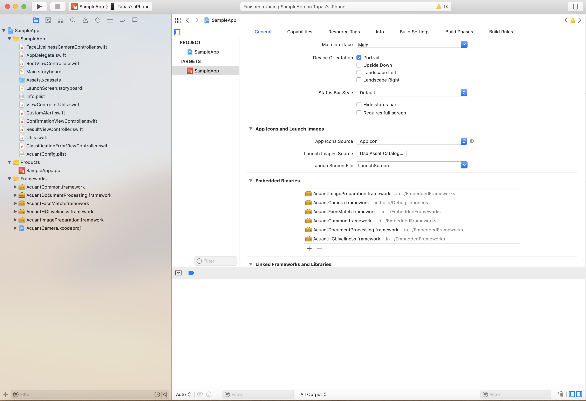
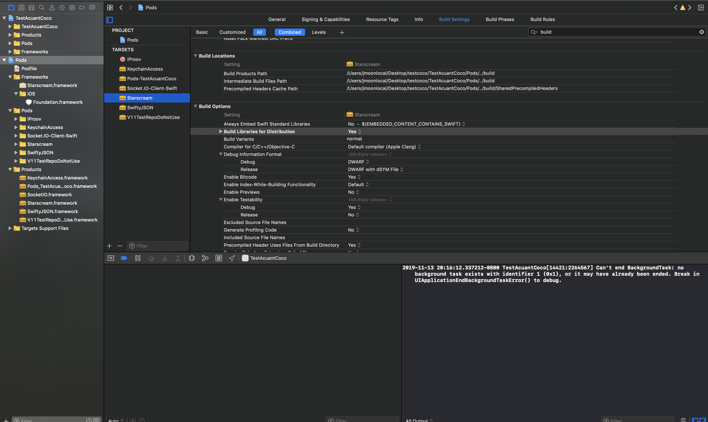

# Acuant iOS SDK v11.3.2

**March 2020**

See [https://github.com/Acuant/iOSSDKV11/releases](https://github.com/Acuant/iOSSDKV11/releases) for release notes.

----------

# Introduction

This document provides detailed information about the Acuant iOS SDK. The Acuant-recommended workflow is described below.

**Note** The acceptable quality image is well-cropped, sharp and with no glare present, has a resolution of at least 300 dpi (for data capture) or 600 dpi (for authentication). The aspect ratio should be acceptable and matches an ID document.

----------
## Prerequisites

- iOS version 11.0 or later

## Modules

The SDK includes the following modules:

**Acuant Face Capture Library (AcuantFaceCapture):**

- Uses native iOS Camera to capture face.

**Acuant Passive Liveness Library (AcuantPassiveLiveness):**

- Uses proprietary algorithm to detect a live person

**Acuant Common Library (AcuantCommon):**

- Contains all shared internal models and supporting classes

**Acuant Camera Library (AcuantCamera):**

- Implemented using iOS native camera library
- Uses **AcuantImagePreparation** for cropping

**Acuant Image Preparation Library (AcuantImagePreparation):**

- Contains all image processing such as cropping, calculation of sharpness and glare

**Acuant Document Processing Library (AcuantDocumentProcessing):**

- Contains all the methods to upload the document images, process and get results

**Acuant Face Match Library (AcuantFaceMatch):**

- Contains a method to match two face images

**Acuant HG Liveness Library (AcuantHGLiveness):**

- Uses iOS native camera library to capture facial liveliness using a proprietary algorithm

**Acuant IP Liveliness Library (AcuantIPLiveness):**

- Uses proprietary algorithm to detect a live person

----------
### Manual Setup

1. Add the following dependent embedded frameworks:

 -	**AcuantFaceCapture**
 -	**AcuantPassiveLiveness**
 -	**AcuantCommon**
 -	**AcuantImagePreparation**
 -	**AcuantCamera**
 -	**AcuantDocumentProcessing**
 -	**AcuantHGLiveness**
 -	**AcuantFaceMatch**
 - **AcuantIPLiveness**
	 	- iProov.framework
 		- KeychainAccess.framework
 		- SocketIO.framework
 		- Starscream.framework
 		- SwiftyJSON.framework

	

1. Open your project in Xcode and navigate to Build Phases tab in application project settings. Add a "New Run Script".

1.  Add the following to the script.

		/usr/local/bin/carthage copy-frameworks

1. Create new inputFileList.xcfilelist and outputFileList.xcfilelist. Add necessary frameworks to both files. Example in repository.

1. Add the .xcfilelist to your run script. For additional information, please visit [https://github.com/Carthage/Carthage](https://github.com/Carthage/Carthage).

----------

### Using COCOAPODS
1. If you are using COCOAPODS, then add the following podfile:

		platform :ios, '11.0'
		pod 'AcuantiOSSDKV11', '~> 11.3.2'
		
		
1. 	Enable "BUILD\_FOR\_DISTRIBUTION" for all Acuant pod frameworks in Build Settings.

	- Using Cocoapods. Add to your Podfile.
		
			post_install do |installer|
				installer.pods_project.targets.each do |target|
					if ['AcuantiOSSDKV11', 'KeychainAccess', 'Socket.IO-Client-Swift', 'Starscream' 'SwiftyJSON'].include? target.name
						target.build_configurations.each do |config|
							config.build_settings['BUILD_LIBRARY_FOR_DISTRIBUTION'] = 'YES'
						end
					end
				end
			end
	
	- Manually
	
		
		

----------

### Required Setup
1. Create a **plist** file named **AcuantConfig** which includes the following details:

    	<?xml version="1.0" encoding="UTF-8"?>
		<!DOCTYPE plist PUBLIC "-//Apple//DTD PLIST 1.0//EN" "http://www.apple.com/DTDs/PropertyList-1.0.dtd">
		<plist version="1.0">
			<dict>
				<key>acuant_username</key>
				<string>xxxxxx@acuantcorp.com</string>
				<key>acuant_password</key>
				<string>xxxxxxxxxx</string>
				<key>acuant_subscription</key>
				<string>xxxxxxxxxxxxxxxxxxxxxxxxxxxxxxxxx</string>
				<key>frm_endpoint</key>
				<string>https://frm.acuant.net</string>
				<key>passive_liveness_endpoint</key>
				<string>https://passlive.acuant.net</string>
				<key>med_endpoint</key>
				<string>https://medicscan.acuant.net</string>
				<key>assureid_endpoint</key>
				<string>https://services.assureid.net</string>
			</dict>
		</plist>

----------
### Capture an Image using AcuantCamera

1. AcuantCamera is best used in portrait mode. Lock the orientation of the app before using Camera. 

1. Set up callbacks:
		
		// Returns the image and barcodeString captured from device
		public protocol CameraCaptureDelegate {
	    	func setCapturedImage(image:Image, barcodeString:String?)
		}
		
2. Open the camera: 

	**Note:**   Options are now defined through an options object. See **AcuantCameraOptions** for all configurable fields.
		
        let options = AcuantCameraOptions(autoCapture: true, hideNavigationBar: true)
        let documentCameraController = DocumentCameraController.getCameraController(delegate:self!, cameraOptions: options)
        
        navigationController.pushViewController(documentCameraController, animated: false)

3. Get the captured image:

		public protocol CameraCaptureDelegate {
	    	func setCapturedImage(image:Image, barcodeString:String?)
		}
		
		
**Custom UI with DocumentCaptureSesssion (see DocumentCameraController.swift for reference):**

1. Get the DocumentCaptureSesssion.
		
		@objc public protocol DocumentCaptureDelegate {
		    func readyToCapture() // gets called when triggering capture
		    func documentCaptured(image:UIImage, barcodeString:String?) // gets called with captured result
		}
		
		let captureSession = DocumentCaptureSession.getDocumentCaptureSession(
			delegate: DocumentCaptureDelegate, // session callback
			frameDelegate: FrameAnalysisDelegate, // frame anaylsis callback
			autoCapture:Bool, // enable frame analysis
			captureDevice:AVCaptureDevice?) // AV Capture Device 
			
1. Start the session, and then add the session to AVCaptureVideoPreviewLayer.

		captureSession.start() // will start the capture session.
		let videoPreviewLayer = AVCaptureVideoPreviewLayer(session: captureSession)
		//add custom ui

		
1. Receive Frame Results.
		
		@objc public enum FrameResult : Int{
		    case NO_DOCUMENT, // No document
		    	SMALL_DOCUMENT, // Document is small
		    	BAD_ASPECT_RATIO, // Document type does not match aspect ratio
		    	GOOD_DOCUMENT, // Document is good to trigger capture
		    	DOCUMENT_NOT_IN_FRAME // Document is not in frame
		}
		
		@objc public protocol FrameAnalysisDelegate{
		    func onFrameAvailable(frameResult: FrameResult, points: Array<CGPoint>?)
		}
		
1. Trigger capture.

		captureSession.enableCapture()
		
1. DocumentCaptureDelegate will be executed with result
	
		func documentCaptured(image:UIImage, barcodeString:String?)

	**Note:**   **AcuantCamera** is dependent on **AcuantImagePreparation** and  **AcuantCommon**.

----------
### AcuantImagePreparation

This module contains all image preparation functionality.

-	**Initialization**

		AcuantImagePreparation.initialize(delegate: InitializationDelegate)

		public protocol InitializationDelegate {
    		func initializationFinished(error: AcuantError?);
		}

	**Note:** If you are *not* using a configuration file for initialization, then use the following statement (providing appropriate credentials for *username*, *password*, and *subscription ID*):
	
		Credential.setUsername(username: "xxx")
		Credential.setPassword(password: "xxxx")
		Credential.setSubscription(subscription: "xxxxxx")

		let endpoints = Endpoints()
		endpoints.frmEndpoint = "https://frm.acuant.net"
		endpoints.healthInsuranceEndpoint = "https://medicscan.acuant.net"
		endpoints.idEndpoint = "https://services.assureid.net"

		Credential.setEndpoints(endpoints: endpoints)

		AcuantImagePreparation.initialize(delegate:self)
		

#### **Initialization without a Subscription ID**

**AcuantImagePreparation** may be initialized by providing only a username and a password. However, without providing a Subscription ID, the application can only capture an image and get the image. 
Without a Subscription ID:

-	Only the **AcuantCamera**, **AcuantImagePreparation**, and **AcuantHGLiveness** modules may be used.
-	The SDK can be used to capture the identity documents.
-	The captured images can be exported from the SDK. See the **DocumentCaptureDelegate** protocol in the **AcuantCamera** project.

		public protocol DocumentCaptureDelegate {
    		func readyToCapture()
    		func documentCaptured(image:UIImage, barcodeString:String?)
		}

#### Cropping

After the image is captured, it is sent to the cropping library for cropping.

		public class func crop(data: CroppingData)->Image

		// CroppingData & Image are part of AcuantCommon
		// Sample

		let croppingData  = CroppingData()
        croppingData.image = image // UIImage

        let croppedImage = AcuantImagePreparation.crop(data: croppingData)

#### Sharpness

The **sharpness** method returns a sharpness value of an image. If the sharpness value is greater than 50, then the image is considered sharp (not blurry).

		public class func sharpness(image: UIImage)->Int

#### Glare

The **glare** method returns the glare value of an image. If the glare value is 100, then the image does not contain glare. If the glare value is 0, then image contains glare.

		public class func glare(image: UIImage)->Int
		

----------

### AcuantDocumentProcessing

After a document image is captured, it can be processed using the following steps.

**Note:**  If an upload fails with an error, retry the image upload using a better image.

1. Create an instance:

		public class func createInstance(options:IdOptions,delegate:CreateInstanceDelegate)

		public protocol CreateInstanceDelegate{
    		func instanceCreated(instanceId : String?,error:AcuantError?);
		}

2. Upload an image:

		public class func uploadImage(instancdId:String,data:IdData,options:IdOptions,delegate:UploadImageDelegate)

		public protocol UploadImageDelegate{
    		func imageUploaded(error: AcuantError?,classification:Classification?);
		}

3. Get the data:

		public class func getData(instanceId:String,isHealthCard:Bool,delegate:GetDataDelegate?)

		public protocol UploadImageDelegate{
    		func imageUploaded(error: AcuantError?,classification:Classification?);
		}

4. Delete the instance:

		public class func deleteInstance(instanceId : String,type:DeleteType, delegate:DeleteDelegate)

		public protocol DeleteDelegate {
    		func instanceDeleted(success : Bool)
		}

----------

----------

### Acuant Face Capture

1. (Optional) Set default Image. Locate "acuant\_default\_face_image.png" in the Assets directory of sample app project. Add this to your app if needed.
	
1. Set localized strings in app's localizables:
		
		"acuant_face_camera_initial" = "Align face to start capture";
		"acuant_face_camera_face_too_close" = "Too Close! Move Away";
		"acuant_face_camera_face_too_far" = "Move Closer";
		"acuant_face_camera_face_has_angle" =  "Face has Angle. Do not tilt";
		"acuant_face_camera_face_not_in_frame" =  "Move in Frame";
		"acuant_face_camera_face_moved" = "Hold Steady";
		"acuant_face_camera_capturing_2" = "Capturing\n2...";
		"acuant_face_camera_capturing_1" = "Capturing\n1...";	
1. Set any UI Customizations needed:
		
		class FaceAcuantCameraOptions{
			public let totalCaptureTime: Int //totoal time to capture
			public let bracketColorDefault: CGColor //bracket color default (no face)
			public let bracketColorError: CGColor //bracket color error (error in face requirements)
			public let bracketColorGood: CGColor //bracket color good (good face requirements)
			public let fontColorDefault: CGColor //font color default
			public let fontColorError: CGColor //font color error
			public let fontColorGood: CGColor //font color good
			public let defaultImageUrl: String //default image
			public let showOval: Bool // show oval
		}
		
		//example
		let options = FaceAcuantCameraOptions()
		
1. Get the Controller and push to navigationController:

		let controller = AcuantFaceCaptureController()
			controller.options = options
			controller.callback = { [weak self]
				(image: UIImage?) in
					
					if(image == nil){
						//user canceled
					}
                
			}
				
		self.navigationController.pushViewController(controller, animated: true)

		
1. Use the callback with the captured result. 

----------

### Acuant Passive Liveness
Acuant recommends using the **LiveAssessment** property rather than the score) to evaluate response. **AcuantPassiveLiveness.startSelfieCapture** will return a rescaled image.

Follow these recommendations to effectively process an image for passive liveness:
#### Image requirements
- **Height**:  minimum 480 pixels; recommended 720 or 1080 pixels
- **Compression**:  Image compression is not recommended (JPEG 70 level or above is acceptable). For best results, use uncompressed images.

#### Face requirements
- Out-of-plane rotation:  Face pitch and yaw angle: from -20 to 20 degrees +/-3 degrees
- In-plane rotation:  Face roll angle: from -30 to 30 degrees +/- 3 degrees
- Pupillary distance:  Minimum distance between the eyes 90 +/- 5 pixels
- Face size: Minimum 200 pixels in either dimension
- Faces per image: 1
- Sunglasses: Must be removed

#### Capture requirements
The following may significantly increase errors or false results:

- Using a motion blur effect
- Texture filtering
- A spotlight on the face and nearest surroundings
- An environment with poor lighting or colored light

**Note**  The use of fish-eye lenses is not supported by this API.

1. Get Passive Liveness result with UIImage:

		//liveness request
		class AcuantLivenessRequest{
		    public let image: UIImage
		    public init(image: UIImage)
		}
		
		//liveness response
		class AcuantLivenessResponse{
			public let score: Int
			public let result: AcuantLivenessAssessment
    		
    		public enum AcuantLivenessAssessment: String{
				case Error
				case PoorQuality
				case Live
				case NotLive
			}
		}
		
		//liveness response
		class AcuantLivenessError{
			public let errorCode: AcuantLivenessErrorCode?
			public let description: String?
			
			
			public enum AcuantLivenessErrorCode: String{
			    case Unknown
			    case FaceTooClose
			    case FaceNotFound
			    case FaceTooSmall
			    case FaceAngleTooLarge
			    case FailedToReadImage
			    case InvalidRequest
			    case InvalidRequestSettings
			    case Unauthorized
			    case NotFound
			    case InternalError
			    case InvalidJson
			}
		}
		
		//example
		AcuantPassiveLiveness.postLiveness(request: AcuantLivenessRequest(image: image)){ [weak self]
			(result: AcuantLivenessResponse?, error: AcuantLivenessError?) in
				//response
		}
    
----------

### AcuantHGLiveness

This module checks for liveness (whether the subject is a live person) by using blink detection. The user interface code for this is contained in the Sample application (**FaceLivenessCameraController.swift**) which customers may modify for their specific requirements.

**Acuant UI in Sample App**

	// Code for HG Live controller
	let liveFaceViewController = FaceLivenessCameraController()
	liveFaceViewController.delegate : AcuantHGLiveFaceCaptureDelegate = self
	self.navigationController.pushViewController(liveFaceViewController, animated: true)

**Custom UI, create a face live capture session:**
		
	enum AcuantFaceType : Int {
	
	    case NONE // No face
		
	    case FACE_TOO_CLOSE // face is too close camera
		
	    case FACE_MOVED // face moved from its original position
		
	    case FACE_TOO_FAR // face is too far from camera
			
	    case FACE_NOT_IN_FRAME // face is not in frame
	    
	    case FACE_GOOD_DISTANCE // face is good distance and in frame
    }

	public protocol AcuantHGLiveFaceCaptureDelegate {
			func liveFaceDetailsCaptured(liveFaceDetails: LiveFaceDetails?, faceType: AcuantHGLiveness.AcuantFaceType)
	}

	public class func getFaceCaptureSession(delegate:AcuantHGLiveFaceCaptureDelegate?, captureDevice: AVCaptureDevice?)-> FaceCaptureSession

    
    let faceCaptureSession = AcuantHGLiveness.getFaceCaptureSession(delegate: self, captureDevice: captureDevice)

----------

### AcuantIPLiveness

The **AcuantIPLiveness** module checks whether the subject is a live person. 

1. Run the setup:

    	AcuantIPLiveness.performLivenessSetup(delegate:LivenessSetupDelegate)

    	public protocol LivenessSetupDelegate{
    		func livenessSetupSucceeded(result:LivenessSetupResult) // Called when setup succeeds
    		func livenessSetupFailed(error:AcuantError) // Called when setup failed
		}

    	public class LivenessSetupResult {
    		public var apiKey : String
    		public var token : String
    		public var userId : String
    		public var apiEndpoint : String
   
		}
		
2. Perform the Liveness test: 
		
	**Note** You can customize the UI as needed by using **LivenessSetupResult**.

		// Adjust various colors for the camera preview:
		setupResult.ui.lineColor = .white
		setupResult.ui.backgroundColor = .black
		setupResult.ui.loadingTintColor = .lightGray
		setupResult.ui.notReadyTintColor = .orange
		setupResult.ui.readyTintColor = .green

		setupResult.ui.title = "title" // Specify a custom title to be shown. Defaults to nil which will show an auto generated message. Set to empty string ("") to hide the message entirely.
		setupResult.ui.regularFont = "SomeFont"
		setupResult.ui.boldFont = "SomeFont-Bold"
		setupResult.ui.fonts = ["SomeFont", "SomeFont-Bold"] // If using custom fonts, specify them here (don't forget to add them to your Info.plist!)
		setupResult.ui.logoImage = UIImage(named: "foo")
		setupResult.ui.scanLineDisabled = false // Disables the vertical sweeping scanline while flashing
		setupResult.ui.autoStartDisabled = false // Disable the "auto start" countdown functionality. The user will have to tap the screen to start liveness test

		AcuantIPLiveness.performLivenessTest(setupResult:LivenessSetupResult, delegate:LivenessTestDelegate)
		
		public protocol LivenessTestDelegate{
			func livenessTestCompleted() // This is for the test; called when Enroll is complete
			func livenessTestCompletedWithError(error:AcuantError?) // This is for the test; called when Enroll is complete and error occured
			func livenessTestProcessing(progress: Double, message: String) // This is for real-time notifications of progress of liveness test. It will be called after user captures live face. It is intended to be used for custom UI progress notification.

		}
		
3. Get the liveness test result:
	
		AcuantIPLiveness.getLivenessTestResult(token:String,userId:String,delegate:LivenessTestResultDelegate)
		
		public protocol LivenessTestResultDelegate{
    		func livenessTestResultReceived(result:LivenessResult) // Called when test result was received successfully
    		func livenessTestResultReceiveFailed(error:AcuantError) // Called when test result was not received
		}

		public class LivenessTestResult {
    		public var passedLivenessTest : Bool = false
    		public var image : UIImage? = nil
    	
		}

The following is a list of dependencies:

- **iProov.framework**
- **KeychainAccess.framework**
- **SocketIO.framework**
- **Startscream.framework**
- **SwiftyJSON.framework**

----------

### AcuantFaceMatch

This module is used to match two facial images:

		public class func processFacialMatch(facialData : FacialMatchData, delegate : FacialMatchDelegate)

		public protocol FacialMatchDelegate {
    		func facialMatchFinished(result:FacialMatchResult?)
		}

		public class FacialMatchData{
    		public var faceImageOne : UIImage // Facial image from ID Card (image gets compressed by 80%)
    		public var faceImageTwo : UIImage // Facial image from selfie capture during liveness check (image gets compressed by 80%)
		}

----------

### Error codes

	public class AcuantErrorCodes{
    	public static let ERROR_InvalidCredentials = -1
    	public static let ERROR_InvalidLicenseKey = -2
    	public static let ERROR_InvalidEndpoint = -3
    	public static let ERROR_InitializationNotFinished = -4
    	public static let ERROR_Network = -5
    	public static let ERROR_InvalidJson = -6
    	public static let ERROR_CouldNotCrop = -7
    	public static let ERROR_NotEnoughMemory = -8
    	public static let ERROR_BarcodeCaptureFailed = -9
    	public static let ERROR_BarcodeCaptureTimedOut = -10
    	public static let ERROR_BarcodeCaptureNotAuthorized = -11
    	public static let ERROR_LiveFaceCaptureNotAuthorized = -12
    	public static let ERROR_CouldNotCreateConnectInstance = -13
    	public static let ERROR_CouldNotUploadConnectImage = -14
    	public static let ERROR_CouldNotUploadConnectBarcode = -15
    	public static let ERROR_CouldNotGetConnectData = -16
    	public static let ERROR_CouldNotProcessFacialMatch = -17
    	public static let ERROR_CardWidthNotSet = -18
    	public static let ERROR_CouldNotGetHealthCardData = -19
    	public static let ERROR_CouldNotClassifyDocument = -20
    	public static let ERROR_LowResolutionImage = -21
    	public static let ERROR_BlurryImage = -22
    	public static let ERROR_ImageWithGlare = -23
    	public static let ERROR_CouldNotGetIPLivenessToken = -24
    	public static let ERROR_NotALiveFace = -25
    	public static let ERROR_CouldNotAccessLivenessData = -26
	}

### Error descriptions

	public class AcuantErrorDescriptions {
    	public static let ERROR_DESC_InvalidCredentials = "Invalid credentials"
    	public static let ERROR_DESC_InvalidLicenseKey = "Invalid License Key"
    	public static let ERROR_DESC_InvalidEndpoint = "Invalid endpoint"
    	public static let ERROR_DESC_Network = "Network problem"
    	public static let ERROR_DESC_InitializationNotFinished = "Initialization not finished"
    	public static let ERROR_DESC_InvalidJson = "Invalid Json response"
    	public static let ERROR_DESC_CouldNotCrop = "Could not crop image"
    	public static let ERROR_DESC_BarcodeCaptureFailed = "Barcode capture failed"
    	public static let ERROR_DESC_BarcodeCaptureTimedOut = "Barcode capture timed out"
    	public static let ERROR_DESC_BarcodeCaptureNotAuthorized = "Barcode capture is not authorized"
    	public static let ERROR_DESC_LiveFaceCaptureNotAuthorized = "Live face capture is not authorized"
    	public static let ERROR_DESC_CouldNotCreateConnectInstance = "Could not create connect Instance"
    	public static let ERROR_DESC_CouldNotUploadConnectImage = "Could not upload image to connect instance"
    	public static let ERROR_DESC_CouldNotUploadConnectBarcode = "Could not upload barcode to connect instance"
    	public static let ERROR_DESC_CouldNotGetConnectData = "Could not get connect image data"
    	public static let ERROR_DESC_CardWidthNotSet = "Card width not set"
    	public static let ERROR_DESC_CouldNotGetHealthCardData = "Could not get health card data"
    	public static let ERROR_DESC_CouldNotClassifyDocument = "Could not classify document"
    	public static let ERROR_DESC_LowResolutionImage = "Low resolution image"
    	public static let ERROR_DESC_BlurryImage = "Blurry image"
    	public static let ERROR_DESC_ImageWithGlare = "Image has glare"
    	public static let ERROR_DESC_CouldNotGetIPLivenessToken = "Could not get face liveness token"
    	public static let ERROR_DESC_NotALiveFace = "Not a live face"
    	public static let ERROR_DESC_CouldNotAccessLivenessData = "Could not access liveness data"
	}

### Image

	public class Image {
    	public var image: UIImage? = nil
    	public var dpi: Int = 0 // dpi value of the captured image
    	public var error: AcuantError? = nil
    	public var isCorrectAspectRatio = false // If the captured image has the correct aspect ratio
    	public var aspectRatio: Float = 0.0 // Aspect ratio of the captured image
    	public var points: Array<CGPoint> = []
    	public var isPassport = false
    	public init(){}
    }
    
### AcuantCameraOptions

    public class AcuantCameraOptions {
        timeInMsPerDigit: Int = 900,
        digitsToShow: Int = 2,
        allowBox: Bool = true,
        autoCapture: Bool = true,
        hideNavigationBar: Bool = true,
        bracketLengthInHorizontal: Int = 80,
        bracketLengthInVertical: Int = 50,
        defaultBracketMarginWidth: CGFloat = 0.5,
        defaultBracketMarginHeight: CGFloat = 0.6,
        colorHold: CGColor = UIColor.yellow.cgColor,
        colorCapturing: CGColor = UIColor.green.cgColor,
        colorBracketAlign: CGColor = UIColor.black.cgColor,
        colorBracketCloser: CGColor = UIColor.red.cgColor,
        colorBracketHold: CGColor = UIColor.yellow.cgColor,
        colorBracketCapture: CGColor = UIColor.green.cgColor
    }
    
### IdOptions
    public class IdOptions {
        public var cardSide: CardSide = CardSide.Front
        public var isHealthCard: Bool = false
        public var isRetrying: Bool = false
        public var authenticationSensitivity: AuthenticationSensitivity = AuthenticationSensitivity.Normal
    }

## Frequently Asked Questions

### What causes an "Unsupported Architecture" error when publishing the app in the Apple App store?

All frameworks are *fat* (multi-architecture) binaries that contain *slices* for **armv7**, **arm64**, **i386**, and **x86(64)**  CPU architectures. ARM slices are used by physical iOS devices, while i386 and x86(64) are used by the simulator.

Use the **lipo** command to check which slices are contained in the binaries:

    	lipo -info <path to the file>

You can also use the **lipo** command to remove unwanted slices:

    	lipo -remove i386 <Path to the file> -o <Output file path>

		lipo -remove x86_64 <Path to the file> -o <Output file path>

### Why does the Code signing “AcuantCommon.framework” error occur when I archive the sample application?

Acuant provides support for all CPU architectures that are required by simulators and devices. However, when exporting or publishing to the Test Flight/App Store, the simulator architectures (i386 and x86(64)) should be removed from the framework binaries. 

1. Archive the application. 
2. Select the archive and then click **Distribute app> App store > Export**.

### How do I obfuscate my iOS application?

Acuant does not provide obfuscation tools, however several third-party tools, including **iXGuard** and **Arxan**, are available.

-------------------------------------------------------------

**Copyright 2020 Acuant Inc. All rights reserved.**

This document contains proprietary and confidential information and creative works owned by Acuant and its respective licensors, if any. Any use, copying, publication, distribution, display, modification, or transmission of such technology, in whole or in part, in any form or by any means, without the prior express written permission of Acuant is strictly prohibited. Except where expressly provided by Acuant in writing, possession of this information shall not be construed to confer any license or rights under any Acuant intellectual property rights, whether by estoppel, implication, or otherwise.

AssureID and *i-D*entify are trademarks of Acuant Inc. Other Acuant product or service names or logos referenced this document are either trademarks or registered trademarks of Acuant.

All 3M trademarks are trademarks of Gemalto Inc.

Windows is a registered trademark of Microsoft Corporation.

Certain product, service, or company designations for companies other
than Acuant may be mentioned in this document for identification
purposes only. Such designations are often claimed as trademarks or
service marks. In all instances where Acuant is aware of a claim, the
designation appears in initial capital or all capital letters. However,
you should contact the appropriate companies for more complete
information regarding such designations and their registration status.

For technical support, go to: [https://support.acuant.com](https://support.acuant.com)

**Acuant Inc. 6080 Center Drive, Suite 850, Los Angeles, CA 90045**

----------------------------------------------------------
